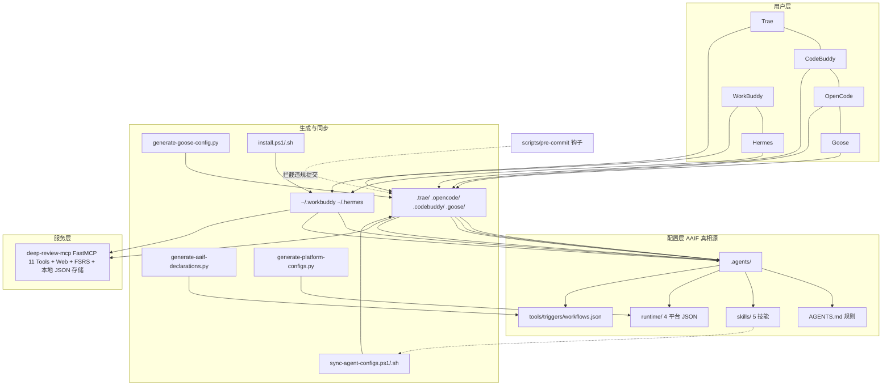

## 产品概述
将 DeepReview（K12 错题收集与智能分析 MCP 工具）从"仅支持 Trae 单平台配置"改造为"支持 AAIF 规范 + 多个 Agent harness"的项目，完整对标 vocabcraft 的成熟模式。

## 核心功能
- 建立 `.agents/` 作为 AAIF 标准唯一配置真相源（AGENTS.md 规则、skills/ 技能、runtime/ 平台运行时配置）
- 自动生成三个 AAIF 标准声明文件：tools.json（MCP 工具自省）、triggers.json（命令+对话触发器）、workflows.json（技能工作流）
- 支持 4 个项目级 harness：Trae、CodeBuddy、OpenCode、Goose，通过同步脚本从 `.agents/` 单向生成各自配置目录
- 支持 2 个人级 harness：WorkBuddy、Hermes，通过安装脚本写入个人配置目录（符号链接 + 降级复制）
- 安装脚本支持 `-AgentRuntime`（trae/codebuddy/opencode/goose/all/workbuddy/hermes）与 `--fix-path` 路径修复
- pre-commit 钩子机械防线：拦截"直接修改生成目录而未同步 .agents/"的违规提交
- 保留全部既有能力：11 个 MCP Tools、OCR 可选依赖、Web 可视化、FSRS 复习调度、本地 JSON 存储

## 边界
- 不修改 deep-review-mcp 服务层业务代码（仅版本号统一），MCP 工具注册与行为保持不变
- 既有 `.trae/rules/` 4 个规则文件内容合并进 `.agents/AGENTS.md` 后删除；`.trae/hooks.json`、`.trae/documents/` 保留
- 版本号统一从 0.2.1 提升至 0.3.0


## 技术栈选择
- 复用项目现有技术栈，不引入新依赖：
  - Python 3.12+ / FastMCP 3.x（AAIF 声明自省 `asyncio.run(server.mcp.list_tools())`）
  - PowerShell（Windows 安装/同步脚本）+ bash（Linux/macOS 安装/同步脚本）
  - uv 包管理器、pytest 测试套件
- 脚本工具链全部为 Python 标准库实现（json / tomllib / re / asyncio / argparse），对标 vocabcraft 的 `scripts/` 结构

## 实现方案
采用 vocabcraft 验证过的"**服务层 + 配置层 + 规则层**"三层分离架构，将 DeepReview 从单平台 `.trae/` 迁移到 AAIF 标准：

1. **`.agents/` 真相源**：`AGENTS.md`（合并现有 4 个 rules + 系统架构 + 安全/Prompt 防御/开发规范 + 「配置同步」流程规则）、`skills/`（迁移 5 个技能，并在 SKILL.md frontmatter 新增 `command:` 字段解决命令名映射）、`runtime/`（4 平台 JSON，由脚本生成）
2. **AAIF 声明文件脚本化生成**：`generate-aaif-declarations.py` 从真实源产出 tools.json / triggers.json / workflows.json（禁止手改），消除配置漂移
3. **单向同步**：`sync-agent-configs.ps1/.sh` 将 `.agents/skills/`、`AGENTS.md`、runtime 配置分发到 `.trae/`、`.opencode/`、`.codebuddy/`、`.goose/`（Goose 经 `generate-goose-config.py` 转 YAML 并解析 `--directory` 为绝对路径）
4. **个人级 harness**：`.workbuddy/README.md`、`.hermes/README.md` 仅存说明文档，安装脚本写入 `~/.workbuddy`、`~/.hermes`（mcp.json 绝对路径 + AGENTS.md/skills 符号链接，失败降级复制）
5. **机械防线**：`scripts/pre-commit` 钩子拦截"生成目录有改动但 `.agents/` 无对应改动"的提交（`.codebuddy/memory/**` 例外）

### 关键决策与权衡
- **命令名映射**：vocabcraft 用硬编码前缀 `name.split("vocabcraft-")` 推导命令，DeepReview 技能名（wrong-question-analyze / review-plan-generate 等）无法直接推导，故在 SKILL.md frontmatter 增加 `command:` 字段（/capture、/analyze、/review、/stats、/batch-capture），生成脚本优先读取该字段，缺省回退按名字派生——通用且可扩展
- **`--no-sync` 对齐**：runtime 配置改用 `uv run --no-sync`（vocabcraft 模式），复用安装时 `uv sync` 的环境，避免每次启动解析依赖；install 脚本会先执行 `uv sync` 保证环境就绪
- **rules 合并而非保留**：对标 vocabcraft（`.agents/` 仅含 AGENTS.md + skills/ + runtime/ + 三个声明文件），4 个规则文件内容并入 AGENTS.md，避免多份规则漂移；`.trae/rules/` 一次性删除
- **版本号**：0.2.1 → 0.3.0，同步更新 pyproject.toml、`__init__.py` 的 `__version__`、install 脚本、文档、CHANGELOG（吸取 0.2.1 版本不一致的历史教训）
- **OCR 逻辑保留**：DeepReview 独有的 OCR 可选依赖安装逻辑（区别于 vocabcraft）原样保留在改造后的 install 脚本中

### 执行细节（防回归）
- `generate-aaif-declarations.py` 的 `MCP_PYPROJECT` 指向 `deep-review-mcp/pyproject.toml`，`import` 改为 `from deep_review_mcp import server`，须通过 `uv run --no-sync --directory deep-review-mcp` 运行
- sync 脚本中 Trae 同步的 `Sync-AgentsMd -TargetDir $ProjectRoot` 将 AGENTS.md 写入项目根（Trae 读取约定），其余平台写入各自目录
- Goose 配置：`generate-goose-config.py` 保留 `--no-resolve-dir` 参数（发布包用相对路径、开发环境用绝对路径）
- pre-commit 钩子拦截名单：`.trae/*`、`.opencode/*`、`.codebuddy/*`、`.goose/*`，例外仅 `.codebuddy/memory/*`
- build-release 打包清单必须使用**带点前缀**目录名（`.trae/` 而非 `trae/`），吸取 vocabcraft 0.5.4 发布失败的教训
- 改造不触碰 `deep-review-mcp/src/deep_review_mcp/` 业务代码（除 `__init__.py` 版本号），11 个工具注册不受影响

## 架构设计


## 目录结构

```
DeepReview/
├── .agents/                                    # [NEW] AAIF 唯一真相源（只改这里）
│   ├── AGENTS.md                               # [NEW] 汇总 4 个 rules + 架构/安全/Prompt防御/开发规范/流程规则（含配置同步强约束）
│   ├── skills/                                 # [NEW] 从 .trae/skills/ 迁移 5 个技能，SKILL.md frontmatter 增加 command: 字段
│   │   ├── wrong-question-capture/SKILL.md     #       /capture（采集）
│   │   ├── wrong-question-batch-capture/       #       /batch-capture（批量采集）
│   │   ├── wrong-question-analyze/             #       /analyze（分析）
│   │   ├── review-plan-generate/               #       /review（复习计划）
│   │   └── wrong-question-stats/               #       /stats（统计）
│   ├── runtime/                                # [NEW] 4 平台运行时配置（generate-platform-configs.py 生成）
│   │   ├── trae.json                           #       mcpServers + ${workspaceFolder} 变量
│   │   ├── codebuddy.json                      #       mcpServers（同 trae schema）
│   │   ├── opencode.json                       #       mcp 块 + instructions: [".agents/AGENTS.md"]
│   │   └── goose.json                          #       extensions/stdio 原生 schema
│   ├── tools.json                              # [NEW] 生成产物：MCP 工具自省（勿手改）
│   ├── triggers.json                           # [NEW] 生成产物：命令+对话触发器（勿手改）
│   └── workflows.json                          # [NEW] 生成产物：技能工作流（勿手改）
├── scripts/                                    # [MODIFY] 新增 5 个工具脚本 + pre-commit
│   ├── generate-platform-configs.py            # [NEW] 生成 .agents/runtime/ 4 平台 JSON
│   ├── generate-goose-config.py                # [NEW] goose.json → .goose/config.yaml（绝对路径解析）
│   ├── generate-aaif-declarations.py           # [NEW] 自省 FastMCP 生成 3 个 AAIF 声明文件
│   ├── sync-agent-configs.ps1                  # [NEW] .agents/ 单向同步到 4 平台目录（PowerShell）
│   ├── sync-agent-configs.sh                   # [NEW] 同上（bash，逻辑对齐）
│   ├── pre-commit                              # [NEW] git 钩子：拦截直接改生成目录
│   ├── build-release.ps1                       # [MODIFY] 打包清单加入 .agents/、.goose/、.workbuddy/、.hermes/（带点目录名）
│   └── build-release.sh                        # [MODIFY] 同上（bash）
├── .workbuddy/README.md                        # [NEW] 个人级 harness 配置说明（仅文档）
├── .hermes/README.md                           # [NEW] 个人级 harness 配置说明（仅文档）
├── AGENTS.md                                   # [NEW] 同步产物（sync 脚本写入项目根，供 Trae 读取）
├── install.ps1                                 # [MODIFY] -AgentRuntime/-FixPath 参数 + 个人级 harness 安装 + pre-commit 钩子 + 保留 OCR 逻辑
├── install.sh                                  # [MODIFY] 同上（bash）
├── .trae/                                      # [MODIFY] 生成目录：mcp.json/skills/AGENTS.md 被同步覆盖；rules/ 删除（内容并入 AGENTS.md）；hooks.json、documents/ 保留
├── .opencode/                                  # [NEW] 生成目录
├── .codebuddy/                                 # [NEW] 生成目录（memory/ 由运行时写入，例外）
├── .goose/                                     # [NEW] 生成目录（config.yaml + skills/ + AGENTS.md）
├── README.md                                   # [MODIFY] AAIF 真相源 + 多 harness 使用说明 + 版本 0.3.0
├── QUICKSTART.md                               # [MODIFY] 多 harness 安装步骤 + 版本 0.3.0
├── DEPLOY.md                                   # [MODIFY] 配置同步流程 + 版本 0.3.0
├── CHANGELOG.md                                # [MODIFY] 0.3.0 变更记录
├── .gitignore                                  # [MODIFY] 检查：生成目录提交、.venv/data 忽略
└── deep-review-mcp/
    ├── pyproject.toml                          # [MODIFY] version 0.2.1 → 0.3.0（AAIF 声明元数据来源）
    └── src/deep_review_mcp/__init__.py         # [MODIFY] __version__ 0.2.1 → 0.3.0
```


## Agent 扩展
### SubAgent
- **code-explorer**
  - 用途：执行阶段第 1 步先盘查 DeepReview 剩余未读文件（`scripts/build-release.ps1/.sh` 打包清单结构、`.gitignore` 现有忽略规则、`docs/` 目录内容、`deep_review_mcp/__init__.py` 版本号位置），确保目录结构与文件清单零遗漏
  - 预期产出：完整的受影响文件清单与打包清单需新增项，避免改造遗漏或破坏既有发布流程
