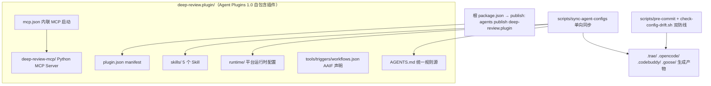

## 产品概述

将 DeepReview 从 `.agents/` 配置层架构升级为符合 **Agent Plugins 1.0（AAIF / Linux 基金会）** 规范的自包含插件包，完全对齐参照项目 vocabcraft 的合规模式。用户已确认：**完全对齐**（MCP server 内联进插件目录、删除 `.agents/`）与**版本 bump 至 0.5.0**。

## 核心功能

- 新建 `deep-review.plugin/` 插件根目录，内含 Agent Plugins 1.0 标准 `plugin.json`（manifest）与 `mcp.json`（`${PLUGIN_ROOT}` 内联 MCP 启动配置），使插件自包含、可整体分发
- 将配置层（AGENTS.md、skills/、runtime/、AAIF 声明文件）与 MCP 服务层（deep-review-mcp/）全部迁入插件目录，删除 `.agents/`
- 将 AAIF 三个声明文件（tools.json / triggers.json / workflows.json）从旧格式重写为规范格式（tools 顶层 name/version/description；triggers 用 type/pattern/handler；workflows 用 name/steps）
- 新建根 `package.json`（`main: deep-review.plugin/tools.json`、`publish: agents publish deep-review.plugin`），支持标准插件发布
- 同步脚本、pre-commit 钩子、CI 全部改为从 `deep-review.plugin/` 读取；新增 `check-config-drift.sh` 与 CI config-drift job 双防线
- 版本号 0.5.0 在 pyproject / __init__ / web app / install / build-release / plugin.json / package.json / 文档 全链路一致

## 边界与约束

- `.trae/`、`.opencode/`、`.codebuddy/`、`.goose/` 仍为生成产物，禁止直接编辑（仅 `.codebuddy/memory/**` 例外）
- 配置同步流程不变：改 `deep-review.plugin/` → 跑 `scripts/sync-agent-configs` → 各生成目录一起提交
- MCP 服务逻辑、Skill 内容、业务规则不变，纯结构重构


## 技术栈

- 沿用现有：Python 3.12+ / FastMCP / Pydantic v2 / uv / pytest
- 新增规范层：Agent Plugins 1.0（`agent-plugins.org/schemas/1.0.0/plugin.schema.json` + `mcp.schema.json`）、AAIF 声明规范格式、根 `package.json`（Node 配置别名，无运行时依赖）
- 参照 vocabcraft 已验证的合规实现模式（plugin.json / mcp.json / 新格式声明 / package.json / 双防线脚本）

## 实现思路

通过**目录重构 + 声明重写 + 工具链对齐**三步完成合规迁移：

1. **目录重构**：`.agents/` → `deep-review.plugin/`，`deep-review-mcp/` → `deep-review.plugin/deep-review-mcp/`，删除 `.agents/`。插件根目录成为 AAIF 唯一真相源，同时满足规范"插件相对路径必须解析在插件根内"的自包含要求。
2. **声明重写**：重写 `scripts/generate-aaif-declarations.py`，输出对齐 vocabcraft 的规范格式（tools.json 顶层 `name/version/description/tools`，去掉 package 包装与 generated_by 元数据；triggers.json 用 `type:"command"/"conversation"` + `pattern` 正则 + `handler`；workflows.json 用 `name/description/steps:[{action,description}]`），并从 FastMCP 实时自省 + SKILL.md 重新生成。
3. **工具链对齐**：同步脚本、平台配置生成、pre-commit（升级为内容一致性检查）、check-config-drift.sh（新增）、build-release、install、CI 全部从 `deep-review.plugin/` 读取；新增 package.json 支持 `agents publish` 标准发布。

**关键决策与权衡**：
- MCP server 内联（而非轻量分离）：规范要求 mcp.json 中路径解析必须留在插件根内，内联才能实现自包含可分发；代价是移动整个 MCP 代码库、更新全部路径引用——通过全量 grep 排查控制风险。
- pre-commit 升级为 vocabcraft 式"内容一致性校验"（逐字节比对源与生成目录），替代旧式"同时出现判断"，可同时拦截直改生成目录、改源忘同步两类违规。

**性能与可靠性**：声明文件由脚本自省实时生成，杜绝手改漂移；pre-commit（暂存区）+ CI config-drift（工作区）双防线；移动目录不改变服务逻辑，风险集中在路径引用，用 grep 全量排查并跑通 sync/lint/test/构建验证。

**避免技术债**：完全复用 vocabcraft 已打磨的脚本模式（sync 流程、pre-commit、check-config-drift、build-release 打包清单），不引入新框架；不新增 Python/Node 运行时依赖。

## 实施注意

- **路径引用全量排查**：迁移后 grep 全仓库 `\.agents|deep-review-mcp`，逐一更新 scripts/、install.ps1/.sh、.github/workflows/、文档、.gitignore 中引用。
- **uv 运行方式对齐**：声明生成改为 vocabcraft 风格 `uv run --no-sync --directory deep-review.plugin/deep-review-mcp python ../../scripts/generate-aaif-declarations.py`（uv 会切换工作目录，需 ../../ 相对路径）。
- **版本一致性**：0.5.0 需同步至 pyproject.toml、`deep_review_mcp/__init__.py`、`web/app.py`、install 脚本标题、build-release 默认参数、plugin.json、package.json、README/DEPLOY/CHANGELOG，提交前用 check_version 校验。
- **数据目录**：`deep-review-mcp/data/` 移动后 .gitignore 路径同步更新为 `deep-review.plugin/deep-review-mcp/data/...`；构建脚本仍只复制 .gitkeep 占位。
- **web 入口**：`deep-review-web` 脚本入口与 install 脚本中 `uv run deep-review-web` 的 cd 路径同步更新。
- **发布版 mcp.json**：build-release 中硬编码的 `${workspaceFolder}/deep-review-mcp` 路径更新为 `${workspaceFolder}/deep-review.plugin/deep-review-mcp`。

## 架构设计



分层不变：服务层（内联 MCP server）+ 配置层（`deep-review.plugin/` AAIF 真相源）+ 规则层（`deep-review.plugin/AGENTS.md`）+ 数据存储层（本地 JSON）。各 harness 原生目录仍由同步脚本单向生成，互不冲突。

## 目录结构

```
DeepReview/
├── deep-review.plugin/                          # [NEW] Agent Plugin 根（AAIF 唯一真相源，自包含可分发）
│   ├── plugin.json                              # [NEW] Agent Plugins 1.0 manifest（$schema/name/version/description/author/license/keywords）
│   ├── mcp.json                                 # [NEW] MCP 启动配置（type:stdio, command:uv, args 含 ${PLUGIN_ROOT}/deep-review-mcp）
│   ├── AGENTS.md                                # [MOVE] 自 .agents/AGENTS.md（统一规则源）
│   ├── skills/                                  # [MOVE] 自 .agents/skills/（5 个 Skill 原样迁移）
│   ├── runtime/                                 # [MOVE] 自 .agents/runtime/（trae/codebuddy/opencode/goose.json，路径引用更新）
│   ├── tools.json / triggers.json / workflows.json  # [REGEN] 重写生成器后按规范新格式重新生成
│   └── deep-review-mcp/                         # [MOVE] 自根目录 deep-review-mcp/（含 src/data/tests/pyproject/uv.lock，版本 0.5.0）
├── package.json                                 # [NEW] main 指向 deep-review.plugin/tools.json，scripts 含 generate-declarations/sync-configs/publish
├── AGENTS.md                                    # 根级（Trae 读取），由 sync 从 deep-review.plugin/AGENTS.md 复制
├── scripts/
│   ├── generate-aaif-declarations.py            # [MODIFY] 输出规范格式（对齐 vocabcraft）；路径 .agents→deep-review.plugin
│   ├── sync-agent-configs.ps1 / .sh             # [MODIFY] 源路径与 mcp 目录更新
│   ├── generate-platform-configs.py             # [MODIFY] RUNTIME_DIR 与 ${workspaceFolder} 路径更新
│   ├── generate-goose-config.py                 # [MODIFY] RUNTIME_JSON 与相对路径更新
│   ├── pre-commit                               # [MODIFY] 升级为内容一致性检查（对齐 vocabcraft）
│   └── check-config-drift.sh                    # [NEW] CI 工作区漂移检查（对齐 vocabcraft）
├── install.ps1 / install.sh                     # [MODIFY] 路径（.agents→deep-review.plugin、deep-review-mcp 内联）+ 版本 0.5.0
├── scripts/build-release.ps1 / .sh              # [MODIFY] 打包清单改为 deep-review.plugin/ 内联结构 + 版本 0.5.0
├── .github/workflows/test.yml                   # [MODIFY] MCP 目录路径 + 新增 config-drift job
├── .github/workflows/release.yml                # [MODIFY] 构建调用不变（脚本内部处理），核对路径
├── .gitignore                                   # [MODIFY] data 路径前缀更新为 deep-review.plugin/deep-review-mcp/
├── README.md / QUICKSTART.md / DEPLOY.md        # [MODIFY] 架构图、目录结构、路径引用、Agent Plugins 1.0 打包说明
├── CHANGELOG.md                                 # [MODIFY] 新增 [0.5.0] 条目
└── .trae/ .opencode/ .codebuddy/ .goose/        # [REGEN] 由 sync-agent-configs 重新生成
```

## 关键代码结构

`plugin.json` 与 `mcp.json` 是规范合规的核心契约，结构如下：

```json
// deep-review.plugin/plugin.json
{
  "$schema": "https://agent-plugins.org/schemas/1.0.0/plugin.schema.json",
  "name": "deep-review",
  "version": "0.5.0",
  "description": "DeepReview K12 错题收集与智能分析 Agent Plugin（采集→分类→分析→FSRS v6 复习排程）",
  "author": "yecll",
  "license": "MIT",
  "keywords": ["k12", "wrong-question", "mcp", "agent-plugin", "aaif"]
}
```

```json
// deep-review.plugin/mcp.json
{
  "$schema": "https://agent-plugins.org/schemas/1.0.0/mcp.schema.json",
  "mcpServers": {
    "deep-review-mcp": {
      "type": "stdio",
      "command": "uv",
      "args": ["run", "--no-sync", "--directory", "${PLUGIN_ROOT}/deep-review-mcp", "deep-review-mcp"],
      "cwd": "${PLUGIN_ROOT}"
    }
  }
}
```

```json
// package.json（根，脚本别名与发布入口）
{
  "name": "deep-review",
  "version": "0.5.0",
  "main": "deep-review.plugin/tools.json",
  "scripts": {
    "generate-declarations": "uv run --no-sync --directory deep-review.plugin/deep-review-mcp python ../../scripts/generate-aaif-declarations.py",
    "sync-configs": "powershell -NoProfile -ExecutionPolicy Bypass -File scripts/sync-agent-configs.ps1",
    "publish": "agents publish deep-review.plugin"
  }
}
```

AAIF 声明新格式（生成器输出，勿手改）：

```json
// triggers.json 规范格式
{ "$schema": "https://agents.aaif.io/schemas/triggers.json",
  "triggers": [
    { "type": "command", "pattern": "^/capture(\\s.*)?$", "handler": "handle_command", "description": "wrong-question-capture 命令触发器" },
    { "type": "conversation", "pattern": "(?i)(录入错题|拍照录题|添加错题|上传错题)", "handler": "handle_trigger", "description": "wrong-question-capture 对话触发器" }
  ] }
```

```json
// workflows.json 规范格式
{ "$schema": "https://agents.aaif.io/schemas/workflows.json",
  "workflows": [
    { "name": "wrong-question-capture", "description": "Use when 用户想录入错题…",
      "steps": [ { "action": "classify_question", "description": "调用 classify_question：AI 驱动智能分类错题" } ] }
  ] }
```


## Agent 扩展

### SubAgent
- **code-explorer**
  - 用途：在迁移 `deep-review-mcp/` 与 `.agents/` 目录前后，全面盘点全仓库所有引用 `.agents` 与 `deep-review-mcp` 路径的文件清单，确保无遗漏路径更新点
  - 预期结果：输出完整的受影响文件与引用点清单，作为后续批量修改的核对基准，避免移动目录后残留失效路径
