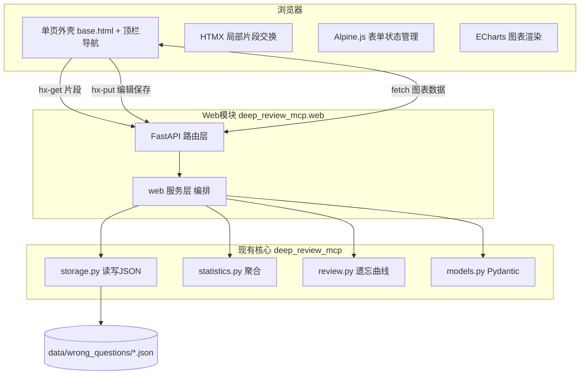

# 错题数据本地 Web 可视化方案设计

> 日期：2026-07-22
> 状态：已批准，待实现
> 范围：为 DeepReview 项目的错题 JSON 数据设计可视化友好的本地 Web 应用

## 一、背景与动机

DeepReview 已积累 30+ 条结构化错题数据（每条独立 JSON 文件），包含 `raw_text`、`structured`（学科/知识点/难度/题型）、`classification`（错误类型）、`analysis`（根因诊断）、`improvement`（改进方案+复习日期）等丰富字段。

现有 `statistics` 工具可按学科/错误类型/知识点/日期分组统计，`export` 工具可导出 Markdown。但**缺少可视化界面**——用户只能查看一堆 JSON 文件或纯文本统计，无法直观洞察错题分布、趋势和薄弱点。

本方案设计一套本地 Web 应用，提供概览、错题列表与详情（可编辑保存）、统计图表、复习追踪四页可视化能力。

## 二、关键决策

| 决策项 | 选择 | 理由 |
|---|---|---|
| 交付形态 | 本地 Web 应用 | 交互性强、可实时筛选、动态切换图表 |
| 技术栈 | FastAPI + HTMX + Alpine.js + ECharts | 无构建步骤、HTMX 局部交换契合编辑后不刷全页、贴合纯 Python 项目 |
| 集成方式 | 独立 web 模块，`uv run deep-review-web` 启动 | 职责清晰、不耦合 MCP 生命周期、可独立测试 |
| 编辑粒度 | 所有字段可编辑保存 | 用户明确要求"边看边编辑保存" |
| 列表+详情布局 | 左右分栏（列表左/详情右） | 便于对照浏览 |
| 安全 | 仅本机 127.0.0.1、零外部请求、JS 库本地化 | 符合 data-safety-rules.md 数据安全规则 |

## 三、整体架构



**核心原则**：Web 模块是现有 storage/statistics/review 的**薄编排层**，不复制数据访问逻辑。所有读写都走 storage，保证与 MCP 工具一致。

## 四、目录结构

新增部分标注 `★`：

```
deep-review-mcp/src/deep_review_mcp/
├── storage.py          （现有，需补原子写+部分更新方法）
├── tools/statistics.py （现有，复用）
├── tools/review.py     （现有，复用 REVIEW_INTERVALS）
├── models.py           （现有，复用）
└── web/                ★ 新增
    ├── __init__.py     ★
    ├── app.py          ★ FastAPI app 工厂 + 路由挂载 + 静态文件
    ├── routes/         ★
    │   ├── __init__.py    ★
    │   ├── dashboard.py   ★ GET / 及 /partials/dashboard
    │   ├── questions.py   ★ 列表/详情/编辑保存
    │   ├── stats.py       ★ 统计图表数据
    │   └── review.py      ★ 复习追踪
    ├── services.py      ★ 编排 storage/statistics/review 的薄服务层
    ├── schemas.py       ★ Web 请求/响应 Pydantic 模型
    ├── templates/       ★ Jinja2 模板
    │   ├── base.html       ★ 单页外壳 + 导航
    │   ├── partials/      ★ HTMX 片段
    │   │   ├── dashboard.html   ★
    │   │   ├── question_list.html  ★
    │   │   ├── question_detail.html ★
    │   │   ├── question_edit.html  ★
    │   │   ├── stats.html         ★
    │   │   └── review.html       ★
    │   └── errors.html     ★ 错误页
    └── static/          ★
        ├── htmx.min.js      ★ 本地化，不走CDN
        ├── alpine.min.js    ★ 本地化
        ├── echarts.min.js   ★ 本地化
        └── app.css          ★ 样式

deep-review-mcp/pyproject.toml  ★ 新增 deep-review-web 入口 + 依赖
deep-review-mcp/tests/          ★ 新增 test_web_*.py
```

**静态库本地化**：HTMX/Alpine/ECharts 三个 JS 库下载到 `static/`，不走 CDN——符合数据安全规则，且离线可用。

## 五、后端 API 设计

| 方法 | 路径 | 用途 | 复用 |
|---|---|---|---|
| GET | `/` | 单页外壳（含导航，内容区由 HTMX 加载） | — |
| GET | `/partials/dashboard` | 返回 Dashboard 片段 HTML | statistics |
| GET | `/api/dashboard/summary` | Dashboard 概览 JSON（图表用） | statistics |
| GET | `/partials/questions` | 错题列表片段（带筛选参数） | storage.query |
| GET | `/partials/questions/{id}` | 单题详情片段（只读） | storage.load |
| GET | `/partials/questions/{id}/edit` | 单题编辑表单片段 | storage.load |
| PUT | `/api/questions/{id}` | 编辑保存，写回 JSON | storage.update |
| GET | `/api/stats` | 统计图表数据（支持 group_by 参数） | statistics |
| GET | `/partials/stats` | 统计页片段 | statistics |
| GET | `/partials/review` | 复习追踪片段 | storage + review |
| GET | `/api/review/upcoming` | 待复习列表 JSON | storage + review |
| POST | `/api/review/{id}/done` | 标记已复习，推进下次复习日期 | storage + review |

### 编辑保存数据流

```
用户点击「编辑」→ GET /partials/questions/{id}/edit 返回编辑表单片段（HTMX 替换详情区）
用户修改字段 → Alpine 管理表单状态 → 点击「保存」
→ PUT /api/questions/{id}（表单数据）
→ web 服务层：load 现有 → 合并 patch → storage.update（原子写回 JSON）
→ 返回更新后的只读详情片段（HTMX 局部替换，不刷全页，保留列表上下文）
```

### 前置改造：storage 增强

现有 `storage.py` 已有 `load_wrong_question`（单条）和 `update_wrong_question`（全量覆盖）。需补：

1. **原子写入**：`save_wrong_question` 改为先写临时文件再 rename，防止写入中途崩溃损坏数据
2. **部分更新方法** `patch_wrong_question(id, patch_dict)`：加载现有 → 合并 patch → 原子写入，方便 Web 编辑保存
3. **标记复习方法** `mark_reviewed(id)`：`review_count += 1`，用 `review._calculate_next_review_date` 重算 `next_review_date`

## 六、前端页面设计

### 单页外壳与 HTMX 局部交换

- `base.html` 是唯一整页：顶栏 + `#content` 空容器，首屏 HTMX 自动加载 Dashboard 片段
- 切换 Tab = `hx-get=/partials/xxx` 替换 `#content`
- 片段返回后，Alpine 用 `x-data` 初始化表单，ECharts 通过 `htmx:afterSwap` 事件触发渲染

### 页面 1：概览 Dashboard

- 4 个 KPI 卡片：错题总数 / 今日待复习数 / 本周新增 / 本周已复习
- 2 个分布图：学科分布（环形图）/ 错误类型（横条图）
- 1 个趋势图：最近 30 天错题量（折线图）
- 今日待复习清单：可点击进详情

### 页面 2：错题列表与详情（核心）

- **左侧列表区**：筛选栏（学科/错误类型/知识点/日期范围/搜索框）+ 错题卡片列表（学科色标+摘要+错误类型+日期）+ 分页
- **右侧详情区**：点击列表卡片 → HTMX 加载详情片段
  - 只读模式：原题文本 / 结构化信息 / 错误类型 / 根因诊断 / 改进方案 / 同类题 / 复习信息 / 原题图片
  - 编辑模式：每块独立可编辑，Alpine 管局部状态，`hx-put` 保存后返回只读片段局部替换

### 页面 3：统计图表页

- 维度切换器：按学科 / 错误类型 / 知识点 / 日期
- 图表矩阵：
  - 主图：柱状图/饼图（当前维度分布）
  - 知识点热力图：按学科分组的知识点错误密度
  - 难度分布：堆叠柱状图（按学科分难度）
  - 错误类型雷达：四类错误占比
  - 时间趋势：折线/面积图（每日错题量）

### 页面 4：复习追踪

- 今日待复习卡片列表 + 「标记已复习」按钮
- 复习日历（月视图，标记有复习任务的日期）
- 遗忘曲线示意图（按复习次数展示理论保留率）
- 各学科复习完成率进度条
- 逾期未复习清单高亮

## 七、错误处理

| 场景 | 处理方式 |
|---|---|
| question_id 不存在 | 404 + HTMX toast 提示 |
| 字段校验失败 | Alpine 前端校验 + Pydantic 后端校验，失败返回 422 + 表单内联错误 |
| JSON 读写异常 | catch IOError，500 + 通用错误页，不暴露路径；原子写防损坏 |
| 无数据（0 条错题） | 空状态占位 + 引导文案 |
| ECharts 渲染异常 | try/catch 降级为纯文本表格 |
| 图片路径不存在 | 占位图标 |

## 八、安全合规

- **零外部请求**：JS 库本地化、无 CDN、无第三方 API
- **仅本机访问**：FastAPI 绑定 `127.0.0.1:8001`
- **无认证**：纯本机单用户（远程访问再加）
- **无日志泄露**：错误日志仅控制台
- **图片本地化**：`image_path` 指向 `data/`，FastAPI `FileResponse` 返回

## 九、测试方案

| 层级 | 工具 | 覆盖 |
|---|---|---|
| 后端单元测试 | pytest + httpx | 各 API 响应（状态码、JSON 结构、边界情况） |
| 后端集成测试 | pytest + httpx AsyncClient | FastAPI app 整体请求链路 |
| 前端 E2E | Playwright | 四页导航、筛选、编辑保存、图表渲染、HTMX 局部交换 |

**E2E 重点场景**：
- Dashboard 加载 → 图表渲染 → 点击待复习项跳转详情
- 列表筛选 → 选学科 → 列表刷新 → 点击卡片 → 详情展开 → 编辑 → 保存 → 局部刷新
- 统计页切换维度 → 图表重绘
- 复习页标记已复习 → review_count 递增 → 日历更新

## 十、新增依赖

```toml
# pyproject.toml [project] dependencies 新增
"fastapi>=0.115",
"uvicorn>=0.30",
"jinja2>=3.1",
"python-multipart>=0.0.9",

# [project.optional-dependencies] dev 新增
"httpx>=0.27",

# [project.scripts] 新增
deep-review-web = "deep_review_mcp.web.app:main"
```

HTMX / Alpine / ECharts 为纯前端 JS，直接下载到 `static/`，不进 Python 依赖。

## 十一、范围边界

**本方案包含**：
- Web 模块完整实现（路由、服务层、模板、静态资源）
- storage 原子写 + 部分更新增强
- 后端单元测试 + 集成测试
- Playwright E2E 测试

**本方案不包含**（YAGNI）：
- 用户认证/授权（纯本机单用户）
- 多用户/多设备同步
- 数据备份/恢复（由用户手动管理 JSON 文件）
- 移动端原生适配（响应式 CSS 基础支持即可）
- 国际化（仅中文）
